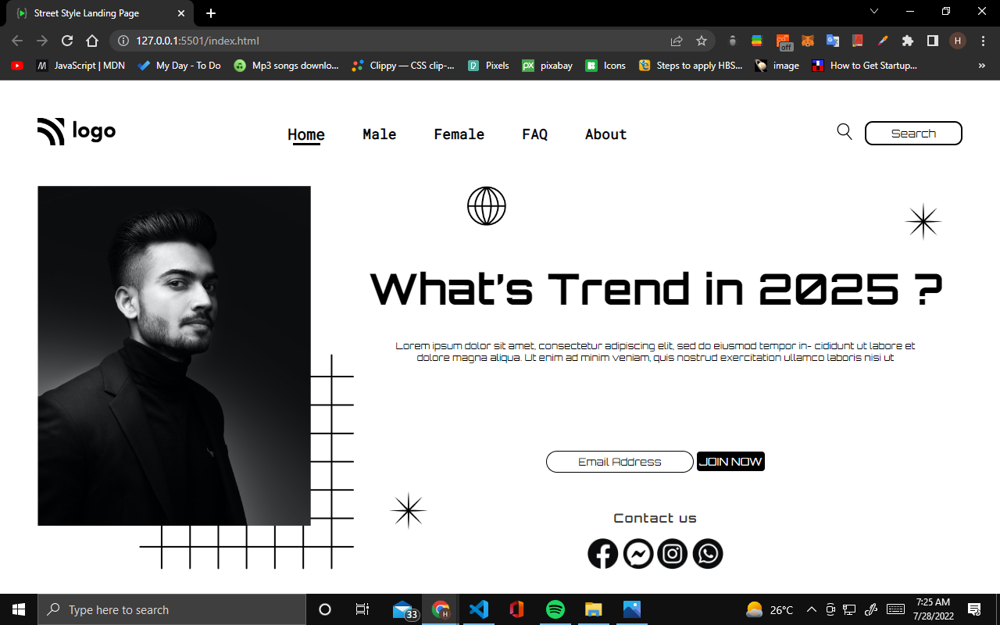

# Project 1 Street Style Landing Page

## Hey there, I am Hitesh Pal

I have build this Landing Template with my core HTML CSS skills

You can check out here: [Street Style  By Hitesh](https://street-style-by-hitesh.netlify.app/)

## What i have learned from this project

    - In this project I have learned how to use HTML and css to Portfolio like templates.
    - How to use flex-box, positions  and proper alignment of elements.

## This project took me around 2:30 hours approximately.

### Connect with me 
[Twitter](https://twitter.com/HiteshP25522550) 
[Linkdin](https://www.linkedin.com/in/hitesh-pal-8379011ab/)
